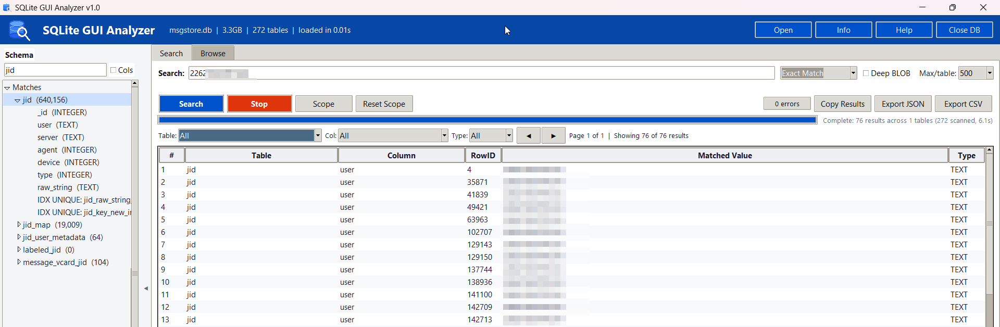
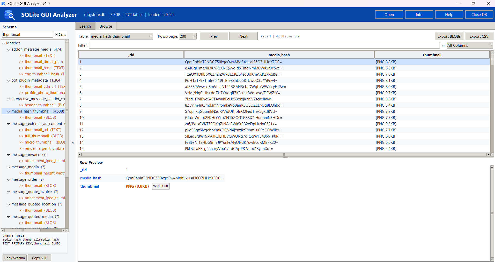
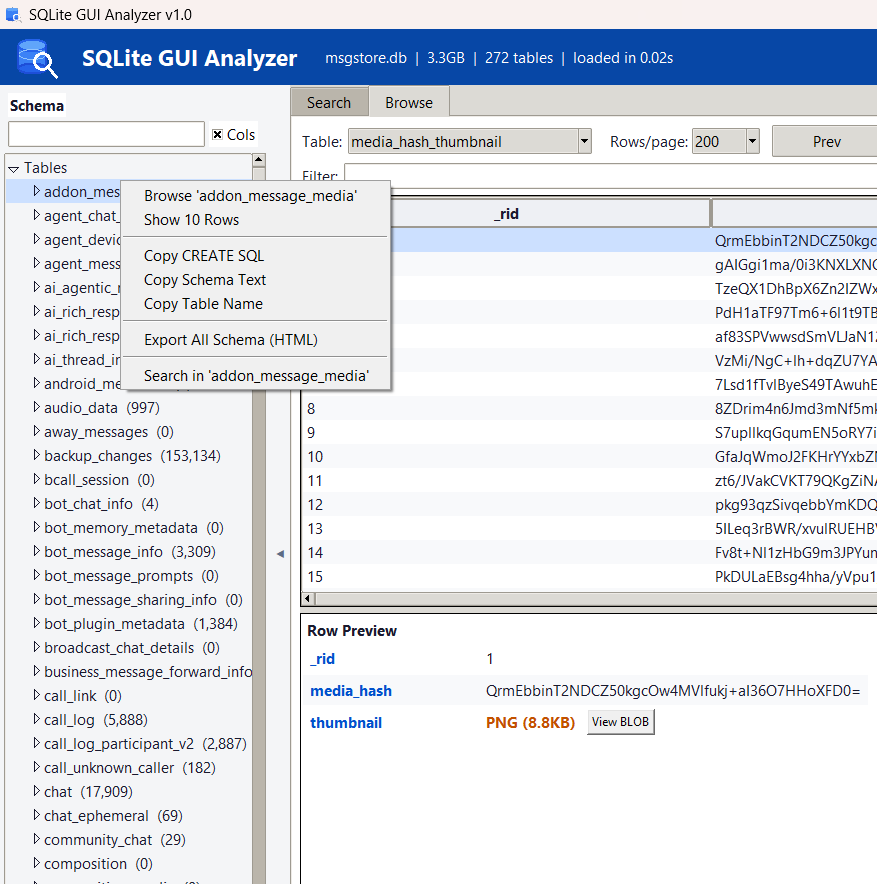

# SQLite GUI Analyzer

**A fast, zero-dependency desktop GUI for searching, browsing, and analyzing SQLite databases.**

Built with Python and tkinter. Single file. No install needed. Read-only -- your data is never modified.

> Perfect for developers, forensic investigators, data analysts, and anyone who needs to quickly explore SQLite databases without writing SQL.




---

## Why This Tool?

Most SQLite viewers choke on large databases, require SQL knowledge, or need complex installations. This tool is different:

- **One file, zero setup** -- just run `python sqlite_forensic_analyzer.py`
- **Handles huge databases** -- tested on 5 GB+ databases with 270+ tables and millions of rows
- **Blazing-fast search** -- searches 3000+ results across 272 tables in under 5 seconds
- **Regex search with LIKE pre-filter** -- email/URL/phone regex patterns complete in 3-5 seconds on million-row tables
- **Read-only** -- your database is never modified (opened with `?mode=ro`)
- **No SQL needed** -- point, click, search, browse
- **Cross-platform** -- works on Windows, macOS, and Linux

---

## Features

### Search Across All Tables

Search your entire database with a single query. Results stream in live as the search runs.

- **8 search modes**: Case-Insensitive, Case-Sensitive, Exact Match, Starts With, Ends With, Regex, BLOB/Hex, Column Name
- **Per-table result counts** for quick triage
- **Filter results** by table, column, or data type using auto-sizing dropdowns
- **Regex engine** with automatic LIKE pre-filtering for fast pattern matching
- **Configurable limits** -- 100, 500, 1000, 5000, or unlimited results per table
- **Search scope** -- restrict search to specific tables with the Scope dialog
- **Export** to CSV or JSON (all results, filtered view, or current page)
- **Copy results** to clipboard for quick sharing
- **Pagination** for large result sets

### Browse Tables

Browse any table with sortable columns, row filtering, and pagination.

- **Click column headers to sort** ascending/descending
- **Filter rows** by any column value in real-time
- **BLOB detection** -- shows file type and size (e.g., `[JPEG 1.2 KB]`, `[PNG 45 KB]`, `[PDF 2.1 MB]`)
- **Export to CSV** -- export the current table view
- **Bulk BLOB export** -- export all BLOBs from a table with progress tracking (All Rows or Current Page)
- **Pagination controls** -- navigate through large tables efficiently
- **Auto-column sizing** -- columns adjust to fit content

### Schema Sidebar

Tree view of every table, view, index, and trigger in your database.

- **Expand tables** to see columns, data types, indexes, and foreign keys
- **Search schema** -- filter tables and columns by name (columns included by default)
- **Right-click context menu** on any table to:
  - Browse table data
  - Preview first 10 rows
  - Copy CREATE SQL statement
  - Set as search scope
  - Export table to CSV
- **SQL preview pane** -- view CREATE statements for selected objects
- **Copy Schema / Copy SQL** buttons for quick documentation
- **Export full schema** to a color-coded HTML report

### Row Detail View

Double-click or press Enter on any row to open a detailed view.

- **Every value is selectable and copyable**
- **Multi-line text support** -- text with line breaks renders in a scrollable Text widget
- **Image previews** for BLOB columns (with Pillow installed)
- **BLOB viewer** -- hex dump, text view, and image preview with zoom controls
- **Copy row as JSON, CSV, or plain text**
- **Export all BLOBs** from a single row (handles multiple BLOB columns per row)
- **Search highlight** -- when opened from search results, scrolls to and highlights the matched value
- **Window pooling** -- opening the same row reuses the existing window

### BLOB Viewer

Inspect binary data stored in BLOB columns.

- **Hex dump** -- classic hex + ASCII view (first 16 KB)
- **Text view** -- UTF-8 decoded text (first 64 KB)
- **Image preview** -- full image rendering with zoom controls (Fit, 100%, Zoom +, Zoom -, mouse wheel)
- **Save** BLOB to file with auto-detected extension
- **Copy as Hex** or **Base64** to clipboard
- **Detected formats**: JPEG, PNG, GIF, TIFF, PDF, ZIP, GZIP, SQLite, RIFF/WebP, bplist, XML/Plist, and more

### Schema HTML Report

Export your entire database schema as a standalone HTML document.

- **Color-coded constraints** -- PK (blue), NOT NULL (red), UNIQUE (purple), DEFAULT (green)
- **Table of contents** with row counts
- **CREATE SQL** per table
- **Foreign key relationships**
- **Responsive design** -- viewable on any screen size
- Great for **team documentation**, SOPs, and audit reports

### Timestamps Auto-Decoded

Numeric timestamps are automatically detected and decoded in the Row Detail view:

- **Unix Epoch** (seconds and milliseconds)
- **WebKit/Chrome** (microseconds since 1601-01-01)
- **Windows FILETIME** (100-nanosecond intervals since 1601-01-01)
- **Mac/Cocoa Absolute Time** (seconds since 2001-01-01)
- **GPS Time** (seconds since 1980-01-06)
- All decoded timestamps shown inline with human-readable date/time

---

## Getting Started

### Requirements

- **Python 3.8+**
- **tkinter** (included with most Python installs)
- **Pillow** (optional, for image previews): `pip install Pillow`

### Run

```bash
python sqlite_forensic_analyzer.py
```

Or open a database directly:

```bash
python sqlite_forensic_analyzer.py path/to/database.db
```

That's it. No pip install, no virtual env, no config files.

---

## Keyboard Shortcuts

| Shortcut | Action |
|----------|--------|
| `Ctrl+O` | Open database |
| `Ctrl+F` | Focus search bar |
| `Enter` | Start search / Open row detail |
| `Escape` | Cancel running search |
| `Double-click` | Open row detail (search results or browse table) |
| `Right-click` | Context menu on schema tree items |

---

## How Search Works

### Standard Search (LIKE-based)

The search engine builds a **single combined SQL query** per table:

```sql
SELECT rowid, * FROM "table_name"
WHERE col1 LIKE ? OR col2 LIKE ? OR ... OR col25 LIKE ?
LIMIT 500
```

One table scan instead of 25 separate queries. BLOB-typed columns are automatically excluded from the SQL WHERE clause to avoid scanning huge binary data, unless Deep BLOB mode is enabled.

### Regex Search (LIKE + Python re)

Regex search uses a two-phase approach for speed:

1. **Literal hint extraction** -- the engine extracts the longest guaranteed literal substring from your regex pattern (e.g., `@` from an email regex, `http` from a URL regex)
2. **SQL pre-filter** -- a `LIKE '%hint%'` clause narrows rows at the database level before Python regex is applied
3. **Cursor-based fetch** -- results are fetched in batches of 5,000 rows for memory efficiency

This approach delivers regex search in **3-5 seconds** on million-row tables, compared to 40-100+ seconds with a naive full-scan approach.

### Performance

A dedicated read-only search connection (without `sqlite3.Row` overhead) ensures consistent performance. No thread contention between search, browse, and schema operations.

Tested with a real-world 3.3 GB WhatsApp database (272 tables, 2.4M+ messages):

| Search Type | Example | Time |
|-------------|---------|------|
| Case-insensitive | `"abcd"` | ~5s |
| Case-insensitive | `"abcdef"` | ~10s |
| Email regex | `[a-zA-Z0-9._%+-]+@...` | ~3-5s |
| URL regex | `https?://[^\s]+` | ~3-4s |
| Phone regex | `\d{3}-\d{3}-\d{4}` | ~4s |
| Special chars | `@gmail.com`, `#`, `$` | ~5-10s |

---

## Use Cases

### Digital Forensics & Incident Response
- Analyze WhatsApp, Signal, Telegram, and other messaging app databases
- Search across all tables simultaneously for keywords, phone numbers, or email addresses
- Export BLOB evidence (images, documents, media) with proper file type detection
- Generate schema reports for case documentation

### Mobile App Development
- Inspect SQLite databases from Android and iOS apps
- Browse Room, CoreData, or raw SQLite schemas
- Verify data integrity and foreign key relationships
- Quick-check data without writing SQL queries

### Data Analysis & Exploration
- Explore unknown SQLite databases with the schema sidebar
- Search for specific values across hundreds of tables
- Export filtered data to CSV or JSON for further analysis
- Decode timestamps from various formats automatically

### Web Development
- Browse browser databases (Chrome History, Firefox Places, cookies)
- Inspect Web SQL databases
- Analyze Django, Flask, or Rails SQLite development databases

---

## Supported Database Types

This tool works with **any valid SQLite database**, including:

- WhatsApp (`msgstore.db`, `wa.db`)
- Signal (`signal.db`)
- Telegram (`cache4.db`)
- Chrome/Chromium (`History`, `Cookies`, `Login Data`)
- Firefox (`places.sqlite`, `cookies.sqlite`)
- iOS Backups (`Manifest.db`, `AddressBook.sqlitedb`)
- Android apps (Room databases, SharedPreferences SQLite)
- Django / Flask / Rails development databases
- Geolocation databases
- Any `.db`, `.sqlite`, `.sqlite3`, or `.db3` file

---

## Technical Details

- **Language**: Python 3.8+
- **GUI Framework**: tkinter / ttk (built-in, no external dependency)
- **Database Access**: Python `sqlite3` module with URI-based read-only mode
- **Architecture**: Single-file (~3500 lines), multi-threaded (search runs in background thread)
- **Memory**: Pagination and streaming results keep memory usage low even on huge databases
- **BLOB Detection**: Signature-based file type identification (JPEG, PNG, GIF, TIFF, PDF, ZIP, GZIP, SQLite, RIFF/WebP, bplist, XML/Plist)
- **Emoji & Unicode**: Full UTF-8 support including emoji display in search results and row detail

---

## FAQ

**Q: Will this tool modify my database?**
A: No. The database is opened in read-only mode (`?mode=ro`). Your data is never changed.

**Q: Can it handle large databases?**
A: Yes. Tested on databases over 5 GB with 270+ tables and millions of rows. Search and browse use pagination and streaming to stay responsive.

**Q: Do I need to know SQL?**
A: No. All features are accessible through the GUI. You can search, browse, filter, and export without writing any SQL.

**Q: What about encrypted databases?**
A: This tool works with standard unencrypted SQLite databases. Encrypted databases (SQLCipher, etc.) need to be decrypted first.

**Q: Can I use this on macOS or Linux?**
A: Yes. Python and tkinter are cross-platform. The tool works on Windows, macOS, and Linux.

---

## Contributing

Contributions are welcome! Feel free to open issues or submit pull requests.

---

## License

MIT
